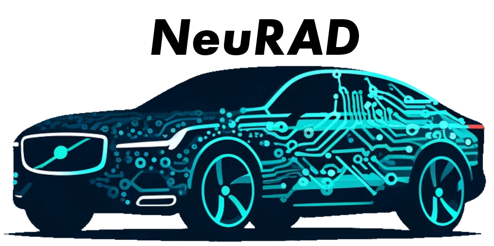
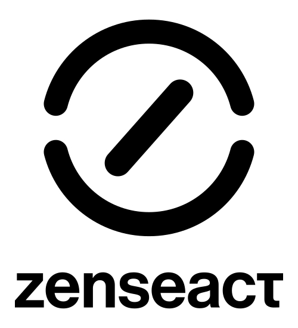
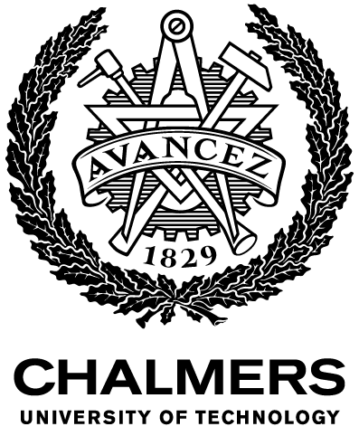
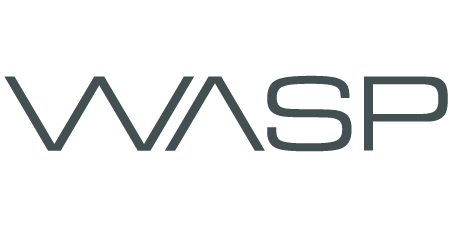

<p align="center">
    <a href="https://research.zenseact.com/publications/neurad/"></a>
    <a href="https://research.zenseact.com/publications/splatad/"></a>
    <a href="https://arxiv.org/abs/2311.15260"></a>
    <a href="https://arxiv.org/abs/2411.16816"></a>
</p>

<div align="center">
<picture>
    <source media="(prefers-color-scheme: dark)" srcset="docs/_static/imgs/neurad_logo_with_text_dark.png" />
    
</picture>
</div>

<div align="center">
<h3 style="font-size:2.0em;">Neural Rendering for Autonomous Driving</h3>
<h4>CVPR 2024 highlight + CVPR 2025  &nbsp;|&nbsp;  + Zero-Shot Dehazing</h4>
</div>

# About

This repository is built on [neurad-studio](https://github.com/georghess/neurad-studio), the official code release of:

- CVPR 2024 [paper](https://arxiv.org/abs/2311.15260) *NeuRAD: Neural Rendering for Autonomous Driving*
- CVPR 2025 [paper](https://arxiv.org/abs/2411.16816) *SplatAD: Real-Time Lidar and Camera Rendering with 3D Gaussian Splatting for Autonomous Driving*

**CoSplat** extends SplatAD with zero‑shot dehazing for foggy autonomous driving scenes. It introduces a per‑Gaussian atmospheric scattering model (ASM) that decomposes foggy scenes into a clean surface stream and a volumetric environment stream, enabling dehazed rendering at inference without any clean‑image supervision. Two independent architecture flags support systematic ablation studies — see [CoSplat](#cosplat) below.

All CoSplat functionality lives in [`nerfstudio/models/splatad.py`](nerfstudio/models/splatad.py) under the standard `splatad` method name, controlled by `SplatADModelConfig` flags. No separate method registration is needed.

<div align="center">
<a href="https://zenseact.com/"><picture style="padding-left:10px;padding-right:10px;"><source media="(prefers-color-scheme:dark)" srcset="docs/_static/imgs/ZEN_Vertical_logo_white.svg"/></picture></a>
<a href="https://www.chalmers.se/en/"><picture style="padding-left:10px;padding-right:10px;padding-bottom:10px;"><source media="(prefers-color-scheme:dark)" srcset="docs/_static/imgs/EN_Avancez_CH_white.png"/></picture></a>
<a href="https://www.lunduniversity.lu.se/"><picture style="padding-left:10px;padding-right:10px;"><source media="(prefers-color-scheme:dark)" srcset="docs/_static/imgs/LundUniversity_C2line_NEG.png"/></picture></a>
<a href="https://liu.se/en"><picture style="padding-left:10px;padding-right:10px;"><source media="(prefers-color-scheme:dark)" srcset="docs/_static/imgs/LiU_secondary_1_white-PNG.png"/></picture></a>
<a href="https://wasp-sweden.org/"><picture><source media="(prefers-color-scheme:dark)" srcset="docs/_static/imgs/WASP-logotype-white.png"/></picture></a>
</div>

# News

[June 2025] Code for [SplatAD](https://research.zenseact.com/publications/splatad/) released in neurad-studio. Uses our custom [gsplat fork](https://github.com/carlinds/splatad). Apptainer users: see [`apptainer_recipe`](apptainer_recipe).

[2025] **CoSplat** added — zero‑shot fog removal for autonomous driving via bias‑driven per‑Gaussian ASM + LiDAR residual offsets.

# Quickstart

## 1. Installation

### Prerequisites

NVIDIA GPU with CUDA 11.7/11.8. See [CUDA install guide](https://docs.nvidia.com/cuda/cuda-quick-start-guide/index.html).

### Create environment

```bash
conda create --name neurad -y python=3.10
conda activate neurad
pip install --upgrade pip
```

### Dependencies

```bash
# PyTorch with CUDA 11.8
pip install torch==2.0.1+cu118 torchvision==0.15.2+cu118 --extra-index-url https://download.pytorch.org/whl/cu118

conda install -c "nvidia/label/cuda-11.8.0" cuda-toolkit

pip install dill --upgrade
pip install --upgrade pip "setuptools<70.0"

pip install ninja git+https://github.com/NVlabs/tiny-cuda-nn/#subdirectory=bindings/torch
```

### Install neurad-studio

```bash
git clone https://github.com/你的用户名/neurad-studio.git
cd neurad-studio
pip install -e .
```

### Install gsplat fork (required for SplatAD / CoSplat)

```bash
pip install git+https://github.com/carlinds/splatad.git
```

## 2. Training

### Data preparation

Download PandaSet and unzip under `data/pandaset`.

For foggy scene training with CoSplat, add synthetic fog via the Koschmieder atmospheric scattering model:

```bash
# PandaSet (β=0.01 light fog)
python scripts/add_fog_pandaset.py \
    --data data/pandaset --seq 001 --beta 0.01 --output data/pandaset_fog

# nuScenes (β=0.01 light fog)
python scripts/add_fog_nuscenes.py \
    --data data/nuscenes --version v1.0-trainval --beta 0.01 --output data/nuscenes_fog
```

### Training commands

All models use the standard `ns-train` interface. CoSplat uses the `splatad` method name — its functionality is enabled through `SplatADModelConfig` flags in `nerfstudio/models/splatad.py`.

```bash
# Train vanilla SplatAD
ns-train splatad pandaset-data --data data/pandaset

# Train CoSplat (zero-shot dehazing, β=0.01 light fog)
ns-train splatad pandaset-data \
    --data data/pandaset_fog --sequence 001 \
    --pipeline.model.fog-beta-init 0.04 --pipeline.model.fog-beta-min 0.03

# Train CoSplat (β=0.02 moderate fog)
ns-train splatad pandaset-data \
    --data data/pandaset_fog --sequence 001 \
    --pipeline.model.fog-beta-init 0.05 --pipeline.model.fog-beta-min 0.04
```

### CoSplat ablation studies

Two independent toggles allow systematic evaluation:

```bash
# Baseline (vanilla SplatAD — no innovations)
ns-train splatad pandaset-data --data data/pandaset_fog --sequence 001 \
    --pipeline.model.use-dual-stream False --pipeline.model.use-lidar-offset False

# +ASM only (Innovation 1 — per‑Gaussian transmission map)
ns-train splatad pandaset-data --data data/pandaset_fog --sequence 001 \
    --pipeline.model.use-dual-stream True --pipeline.model.use-lidar-offset False

# +Offset only (Innovation 2 — LiDAR residual offsets)
ns-train splatad pandaset-data --data data/pandaset_fog --sequence 001 \
    --pipeline.model.use-dual-stream False --pipeline.model.use-lidar-offset True

# Full model (both innovations)
ns-train splatad pandaset-data --data data/pandaset_fog --sequence 001
```

Expected ablation results (PandaSet, β=0.01):

| Configuration | Dehaze PSNR↑ | Dehaze SSIM↑ | Dehaze LPIPS↓ |
| --- | --- | --- | --- |
| Baseline | 13.68 | 0.696 | 0.286 |
| +ASM only | 19.29 | 0.749 | 0.237 |
| +Offset only | 13.71 | 0.696 | 0.285 |
| Full model | 19.54 | 0.752 | 0.236 |

The +0.25 dB improvement from ASM‑only to Full is consistent and arises from the feedback loop: LiDAR offsets → better geometry → more accurate per‑Gaussian depth → more precise transmission map → cleaner ASM decomposition.

## 3. Evaluation

Dedicated evaluation scripts compare the dehazed output against clean ground‑truth images (PSNR / SSIM / LPIPS):

```bash
# PandaSet
python eval_dehaze_full.py \
    --load-config outputs/splatad/EXP_NAME/config.yml \
    --clean-gt-dir data/pandaset/001 \
    --output-dir ./eval_results/ --max-vis 10

# nuScenes
python eval_dehaze_nuscenes.py \
    --load-config outputs/splatad/EXP_NAME/config.yml \
    --clean-data-root data/nuscenes \
    --output-dir ./eval_nuscenes/ --max-vis 10
```

Output: `dehaze_metrics.json`, 4‑panel visual comparisons, and a `summary_grid.png` overview.

## 4. CoSplat

CoSplat achieves zero‑shot dehazing on foggy autonomous driving data through two architectural innovations, both implemented as modifications to `splatad.py`:

**Innovation 1 — Per‑Gaussian Atmospheric Scattering Model**

Each Gaussian primitive is assigned a transmission $t_i = \exp(-\beta \cdot d_i)$ computed from its camera‑space depth $d_i$ (detached to protect geometry). A second lightweight rasterization pass renders the transmission map $t_{\text{map}}$, which is combined with the clean surface RGB via the Koschmieder model:

$$I_{\text{foggy}} = J_{\text{clean}} \cdot t_{\text{map}} + A \cdot (1 - t_{\text{map}})$$

Training uses only foggy images + LiDAR. At inference, the environment stream is discarded, directly rendering the clean scene.

**Bias‑driven training**: The scattering coefficient lower bound $\beta_{\min}$ is set above the true fog density (≈2‑3×) to prevent the ASM decomposition from collapsing to the trivial solution $\beta \to 0$. This forces the CNN decoder to output cleaner colors.

**Innovation 2 — Hierarchical LiDAR Residual Offsets**

LiDAR renders use $\mu + \Delta\mu_{\text{offset}}$ while camera shares the backbone mean $\mu$. The learnable offsets absorb calibration errors and penetration noise (e.g., through glass) with minimal memory overhead — 3 extra floats per Gaussian.

### Key fog parameters (in SplatADModelConfig)

| Parameter | Default (β=0.01) | Description |
| --- | --- | --- |
| `fog_beta_init` | 0.04 | Initial β (before softplus + β_min) |
| `fog_beta_min` | 0.03 | Hard lower bound; set ≈2‑3× true β |
| `fog_beta_reg` | 0.005 | L2 reg on β (kept minimal) |
| `fog_t_min` | 0.20 | Minimum per‑Gaussian transmission |
| `fog_atmospheric_light_reg` | 0.05 | L2 reg pulling A toward (0.95,0.95,0.95) |
| `render_weather` | True | Set False for zero‑shot dehazed rendering |
| `t_map_reg_lambda` | 0.05 | Weak L1 supervision on $t_{\text{map}}$ |
| `depth_weighted_loss_lambda` | 0.30 | sqrt‑depth‑weighted reconstruction loss |
| `ssim_lambda` | 0.30 | SSIM loss weight |

For β=0.02 moderate fog, change only `fog_beta_init=0.05` and `fog_beta_min=0.04`. All other parameters stay identical.

### Dehazing results (from the CoSplat paper)

| Dataset, β | Method | PSNR↑ | SSIM↑ | LPIPS↓ |
| --- | --- | --- | --- | --- |
| PandaSet, 0.01 | SplatAD (baseline) | 13.68 | 0.696 | 0.286 |
| PandaSet, 0.01 | CoSplat | 19.54 | 0.752 | 0.236 |
| PandaSet, 0.02 | SplatAD (baseline) | 11.18 | 0.651 | 0.350 |
| PandaSet, 0.02 | CoSplat | 16.51 | 0.730 | 0.264 |
| nuScenes, 0.01 | SplatAD (baseline) | 13.83 | 0.705 | 0.433 |
| nuScenes, 0.01 | CoSplat | 19.13 | 0.737 | 0.381 |
| nuScenes, 0.02 | SplatAD (baseline) | 9.973 | 0.629 | 0.581 |
| nuScenes, 0.02 | CoSplat | 14.58 | 0.683 | 0.458 |

CoSplat consistently improves PSNR by ≈5 dB across both datasets and fog densities, without ever seeing a clean image during training.

### Limitations (from the paper)

- Residual haze on object boundaries due to alpha‑blending of multiple Gaussian transmissions in $t_{\text{map}}$. Can be mitigated by higher Gaussian density or LiDAR true‑depth supervision.
- Sky regions rely on a fixed `fog_sky_depth` prior (80 m), which may introduce colour artefacts under extreme lighting.
- Real fog has spatial non‑uniformity not captured by a global $\beta$. Extending β to a spatially‑adaptive parameter is future work.

# Available models

| Model | Type | Description |
| --- | --- | --- |
| `splatad` | 3DGS | CVPR 2025 — real‑time camera + lidar rendering |
| `cosplat` | 3DGS | Zero‑shot dehazing built on splatad; use `splatad` method name with config flags |
| `neurad` | NeRF | CVPR 2024 highlight — SOTA NeRF for AD scenes |
| `unisim` | NeRF | Unofficial UniSim implementation (see plugin repo) |

All trained via `ns-train <method> pandaset-data --data <path>`.

# Key features

- Dataparsers for PandaSet, nuScenes, ZOD, Argoverse 2, KITTIMOT, Waymo v2
- Lidar rendering (3D point clouds + intensity + ray drop modeling)
- Rolling shutter compensation for camera and lidar
- Dynamic actor modeling with scene graph decomposition
- Zero‑shot dehazing via surface‑environment dual‑stream 3DGS
- Independent ablation toggles for systematic evaluation

# Built On

# Citation

```bibtex
@inproceedings{tonderski2024neurad,
  title={{NeuRAD}: Neural rendering for autonomous driving},
  author={Tonderski, Adam and Lindstr{\"o}m, Carl and Hess, Georg and Ljungbergh, William and Svensson, Lennart and Petersson, Christoffer},
  booktitle={CVPR}, pages={14895--14904}, year={2024}
}

@inproceedings{hess2024splatad,
  title={{SplatAD}: Real-Time Lidar and Camera Rendering with 3D Gaussian Splatting for Autonomous Driving},
  author={Hess, Georg and Lindstr{\"o}m, Carl and Fatemi, Maryam and Petersson, Christoffer and Svensson, Lennart},
  booktitle={CVPR}, year={2025}
}
```

If you use the CoSplat extension, please cite the CoSplat paper (to appear).
